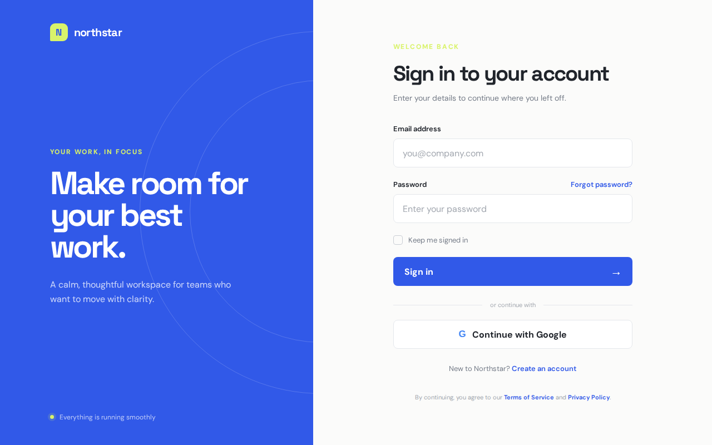

# Northstar Login Page

A polished, responsive login page for **Northstar**, a calm workspace for teams
who want to move with clarity. The page keeps the original split-panel concept
while adapting cleanly across desktop, tablet, and mobile screens.



## Features

- Responsive split-screen layout with a mobile-friendly stacked view
- Accessible labels, autocomplete attributes, and semantic form structure
- Email and password validation through native browser controls
- Remember-me checkbox, password recovery link, and account creation link
- Google sign-in call-to-action
- Keyboard-friendly focus states and reduced-motion support
- Subtle entrance and hover animations

## Technologies

- HTML5
- CSS3 (Grid, Flexbox, custom properties, media queries)
- Google Fonts: DM Sans and Space Grotesk

## Project structure

```text
.
├── assets/
│   └── login-page.png
├── index.html
├── styles.css
└── README.md
```

## Run locally

No build tools or dependencies are required.

1. Clone or download this repository.
2. Open `index.html` directly in a browser, or serve the folder with any
   static web server.

For example, with Python:

```bash
python3 -m http.server 8000
```

Then visit <http://localhost:8000>.

> The form links and sign-in buttons are presentation-only in this static
> project and are ready to connect to an authentication service.
